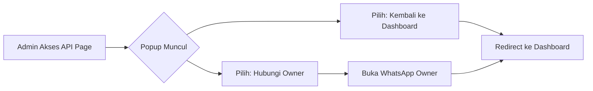

🦅 Pterodactyl Panel Mod by FR3NEWERA

https://via.placeholder.com/1200x400/1a1d21/ffffff?text=🦅+PTERODACTYL+PANEL+MOD+V2.0+BY+FR3NEWERA&font-size=36

Custom Modifikasi Panel Pterodactyl dengan fitur-fitur administratif canggih, sistem keamanan berlapis, dan monitoring real-time untuk manajemen server game yang optimal.

---

📋 DAFTAR ISI

Bagian Deskripsi
✨ Fitur Utama Daftar lengkap semua fitur
🖥️ Sistem yang Didukung OS dan versi yang kompatibel
⚡ Instalasi Cepat Command instalasi otomatis
🔍 Detail Fitur Penjelasan mendalam per fitur
🔧 Pemeliharaan Command maintenance & troubleshooting
💾 Restorasi Database Panduan backup & restore
📞 Kontak & Support Hubungi developer

---

✨ FITUR UTAMA

# Fitur Kategori Deskripsi Singkat
1️⃣ Notifikasi Telegram Monitoring Notifikasi real-time user baru via bot Telegram
2️⃣ Customer Service Sidebar UI/UX Tombol akses cepat ke support Telegram
3️⃣ Dashboard Admin Real-time Monitoring Statistik VPS live (CPU, RAM, Disk)
4️⃣ Branding Custom UI/UX Ganti copyright dengan branding pribadi
5️⃣ God-Mode Protection Security Proteksi akun utama (ID 1) dari modifikasi
6️⃣ Strict Admin Creation Security Hanya owner bisa membuat admin baru
7️⃣ Node View Protection Security Blokir akses detail node untuk admin biasa
8️⃣ API Access Monetization Monetization Pop-up pembelian akses API untuk admin biasa

---

🖥️ SISTEM YANG DIDUKUNG

Operating System Version Status Keterangan
Ubuntu 20.04 LTS ✅ Supported Full compatibility
Ubuntu 22.04 LTS ✅ Supported Recommended version
Debian 10 (Buster) ✅ Supported Stable
Debian 11 (Bullseye) ✅ Supported Recommended
Debian 12 (Bookworm) ✅ Supported Latest

Note: Sistem operasi lain dapat diuji coba secara mandiri. Pastikan environment PHP 8.0+ dan MySQL 8.0+.

---

⚡ INSTALASI CEPAT

Instalasi Otomatis (One-Command)

```bash
bash <(curl -s https://raw.githubusercontent.com/NvidiaFR3/Installer-Mod/main/install.sh)
```

Manual Installation Steps

```bash
# 1. Clone repository mod
cd /var/www/pterodactyl
git clone https://github.com/NvidiaFR3/Pterodactyl-Mod.git mod-temp

# 2. Backup original files
cp -r app resources/views backup-original/

# 3. Apply modifications
# ... (follow instructions in pterodactyl_mod_setup.txt)
```

---

🔍 DETAIL FITUR

---

1️⃣ NOTIFIKASI TELEGRAM USER BARU

https://via.placeholder.com/800x400/2d3748/ffffff?text=📨+TELEGRAM+NOTIFICATION+SYSTEM&font-size=24

📊 Deskripsi Fitur

Sistem notifikasi otomatis yang mengirimkan alert ke Telegram admin setiap kali user baru terdaftar di panel. Mendukung format Markdown dengan informasi lengkap.

🎯 Karakteristik

· ✅ Real-time notification - Instant alert via Telegram bot
· ✅ Rich information - Email, username, admin creator, timestamp
· ✅ Error handling - Logging system for failed notifications
· ✅ Easy configuration - Simple token & chat ID setup

⚙️ Konfigurasi

```php
// File: app/Services/Users/UserCreationService.php
$botToken = "YOUR_BOT_TOKEN";  // From @BotFather
$chatId = "YOUR_CHAT_ID";      // From @userinfobot
```

📋 Data yang Dikirim

```
🔔 *User Baru Dibuat*
👤 Admin: system
📧 Email: user@example.com
🆔 User: newuser123
📅 Tgl: 2024-01-01 12:00:00
```

---

2️⃣ TOMBOL CUSTOMER SERVICE SIDEBAR

https://via.placeholder.com/800x400/4a5568/ffffff?text=👨‍💼+CUSTOMER+SERVICE+SIDEBAR&font-size=24

📊 Deskripsi Fitur

Integrasi langsung ke layanan customer service Telegram melalui sidebar admin panel. Akses cepat tanpa perlu meninggalkan panel.

🎯 Karakteristik

· ✅ Direct access - One-click to Telegram support
· ✅ Custom icon - Medical cross icon for visibility
· ✅ Organized menu - Separate "SUPPORT SYSTEM" section
· ✅ New tab opening - Non-intrusive user experience

📍 Lokasi File

```
resources/views/layouts/admin.blade.php
```

🖥️ Tampilan UI

```html
<li class="header">SUPPORT SYSTEM</li>
<li>
    <a href="https://t.me/your_support" target="_blank">
        <i class="fa fa-user-md"></i> <span>Customer Service</span>
    </a>
</li>
```

---

3️⃣ CUSTOM ADMIN DASHBOARD REAL-TIME

https://via.placeholder.com/800x500/1a1d21/ffffff?text=📊+REAL-TIME+VPS+MONITORING+DASHBOARD&font-size=24

📊 Deskripsi Fitur

Dashboard admin yang sepenuhnya dikustomisasi dengan monitoring real-time sistem VPS. Menampilkan statistik live CPU, RAM, Disk, dan informasi sistem lengkap.

🎯 Fitur Utama

· 📈 Live Resource Monitoring
  · CPU Load (1m, 5m, 15m) dengan progress bar
  · RAM Usage dengan visualisasi persentase
  · Disk Space monitoring dengan free space indicator
· 🖥️ System Information Panel
  · Hostname, OS Version, Kernel
  · Uptime, Panel Version
  · Live date & time display
· 🎨 Modern UI Design
  · Gradient color cards
  · Responsive grid layout
  · Color-coded health indicators

📊 Metrik yang Dimonitor

Metric Source Update Frequency
CPU Load sys_getloadavg() Real-time
RAM Usage free -m Real-time
Disk Usage df -h / Real-time
System Uptime uptime -p Real-time
Total Users Database query On page load
Active Servers Database query On page load

⚠️ Health Status Indicators

Status Color Condition
Normal 🟢 Green CPU < 2, RAM < 80%, Disk < 80%
Warning 🟡 Yellow CPU 2-3, RAM 80-90%, Disk 80-90%
Critical 🔴 Red CPU > 3, RAM > 90%, Disk > 90%

---

4️⃣ UBAH COPYRIGHT FOOTER (BRANDING)

https://via.placeholder.com/800x200/2d3748/ffffff?text=©+2024+FR3NEWERA+PANEL+MOD+V2.0&font-size=28

📊 Deskripsi Fitur

Customisasi branding panel dengan mengganti footer default Pterodactyl dengan identitas brand Anda sendiri.

🎯 Karakteristik

· ✅ Full branding control - Custom text, link, version
· ✅ Professional appearance - Clean footer design
· ✅ Multi-page consistency - Applies to all admin pages

📍 Lokasi File

```
resources/views/layouts/admin.blade.php
```

📝 Kode Customisasi

```html
<footer class="main-footer">
    <div class="pull-right hidden-xs"><b>Ver</b> 2.0</div>
    <strong>Copyright &copy; 2024 <a href="https://fr3newera.com">FR3NEWERA PANEL MOD</a>.</strong>
</footer>
```

---

5️⃣ GOD-MODE PROTECTION (AKUN ID 1)

https://via.placeholder.com/800x400/9d174d/ffffff?text=🛡️+GOD-MODE+ACCOUNT+PROTECTION+SYSTEM&font-size=24

📊 Deskripsi Fitur

Sistem keamanan berlapis untuk melindungi akun utama (ID 1) dari modifikasi tidak sah, baik melalui panel UI maupun direct database access.

🎯 Layer Proteksi

1. 🛡️ Database Protection - Model-level protection di User.php
2. 🔒 UI Protection - Read-only form fields di view
3. 🗑️ Delete Protection - Hidden/disabled delete button
4. 👑 Admin Lock - Permanent admin status lock

📍 Lokasi Implementasi

Layer File Location Protection Type
Database app/Models/User.php Updating & deleting events
UI/View resources/views/admin/users/view.blade.php Read-only fields, hidden buttons

⚙️ Kode Proteksi Database

```php
protected static function booted()
{
    static::updating(function ($user) {
        if ($user->getOriginal('id') === 1 || $user->id === 1) {
            if ($user->isDirty(['email', 'password', 'root_admin', 'username'])) {
                throw new \Exception('FATAL ERROR: Akun GOD-MODE (ID 1) Terlindungi!');
            }
        }
    });
}
```

🔒 Protected Fields

· ✉️ Email address - Cannot be changed
· 🔑 Password - Cannot be reset by others
· 👑 Admin status - Permanently root admin
· 👤 Username - Cannot be modified
· ❌ Account deletion - Complete protection

---

6️⃣ STRICT ADMIN CREATION

https://via.placeholder.com/800x300/f6993f/ffffff?text=🔐+STRICT+ADMIN+CREATION+POLICY&font-size=24

📊 Deskripsi Fitur

Membatasi hak membuat admin baru hanya kepada owner (user ID 1). Admin biasa tidak dapat membuat user dengan status root_admin.

🎯 Karakteristik

· ✅ Controller-level validation - Early request validation
· ✅ Clear error messages - User-friendly exception messages
· ✅ Owner-exclusive privilege - Only ID 1 can create admins

📍 Lokasi File

```
app/Http/Controllers/Admin/UserController.php
```

⚙️ Kode Validasi

```php
// --- MOD START: PROTEKSI CREATE ADMIN ---
if ($request->input('root_admin') == '1') {
    if ($request->user()->id !== 1) {
        throw new \Pterodactyl\Exceptions\DisplayException(
            'AKSES DITOLAK: Hanya Owner (ID 1) yang diizinkan membuat user Admin baru!'
        );
    }
}
// --- MOD END ---
```

---

7️⃣ NODE VIEW PROTECTION

https://via.placeholder.com/800x300/6574cd/ffffff?text=🔒+NODE+DETAIL+ACCESS+CONTROL&font-size=24

📊 Deskripsi Fitur

Mencegah admin biasa mengakses halaman detail node melalui URL manual. Melindungi informasi sensitif node seperti IP address, configuration, dan resource allocation.

🎯 Karakteristik

· ✅ URL bypass protection - Blocks manual URL access
· ✅ Sensitive data protection - Hides node IPs and configs
· ✅ Owner-only access - Exclusive to user ID 1

📍 Lokasi File

```
app/Http/Controllers/Admin/Nodes/NodeViewController.php
```

⚙️ Kode Proteksi

```php
public function index(Request $request, Node $node): View
{
    // --- MOD START: PROTEKSI NODE VIEW ---
    if ($request->user()->id !== 1) {
        throw new \Pterodactyl\Exceptions\DisplayException(
            'AKSES DITOLAK: Halaman detail Node ini diproteksi oleh System (God-Mode).'
        );
    }
    // --- MOD END ---
    
    // ... original code
}
```

---

8️⃣ API ACCESS MONETIZATION

https://via.placeholder.com/800x500/f56565/ffffff?text=💰+API+ACCESS+MONETIZATION+SYSTEM&font-size=24

📊 Deskripsi Fitur

Sistem monetisasi untuk akses API panel. Admin biasa akan melihat pop-up pembelian saat mencoba mengakses halaman Application API.

🎯 Karakteristik

· ✅ SweetAlert2 popup - Professional modal dialog
· ✅ Dual action choice - Return to dashboard or contact owner
· ✅ WhatsApp integration - Direct link to owner's WhatsApp
· ✅ Content hiding - Hides original API content
· ✅ Custom pricing - Adjustable price (default: 5K/account)

📍 Lokasi File

```
resources/views/admin/api/index.blade.php
```

🔄 User Flow



💬 Popup Content

```javascript
Swal.fire({
    title: 'AKSES TERBATAS!',
    html: '<b>HARAP MEMBELI APIKEY KEPADA OWNER UNTUK AKSES FULL DI PANEL INI</b><br><br>' +
          '<span style="color: #f39c12; font-weight: bold;">HARGA APIKEY: 5K / AKUN</span>',
    icon: 'warning',
    showCancelButton: true,
    confirmButtonText: 'Okay (Dashboard)',
    cancelButtonText: 'Contacts Owner\'s',
    allowOutsideClick: false
})
```

---

🔧 PEMELIHARAAN

🔄 Routine Maintenance Commands

```bash
# Setelah melakukan modifikasi file:
php artisan optimize          # Optimize application
php artisan view:clear        # Clear view cache
chown -R www-data:www-data *  # Fix permissions
```

⚠️ Troubleshooting: Error 500

```bash
# Reset UserController ke default original:
rm app/Http/Controllers/Admin/UserController.php
curl -L -o app/Http/Controllers/Admin/UserController.php \
    https://raw.githubusercontent.com/pterodactyl/panel/master/app/Http/Controllers/Admin/UserController.php

# Re-optimize:
php artisan optimize
php artisan view:clear
chown -R www-data:www-data *
```

📦 Recommended Backup Routine

```bash
# 1. Backup database
mysqldump -u root -p pterodactyl > /root/pterodactyl_backup_$(date +%Y%m%d).sql

# 2. Backup panel files
tar -czf /root/pterodactyl_files_$(date +%Y%m%d).tar.gz /var/www/pterodactyl

# 3. Backup modifications
cp -r /var/www/pterodactyl/app /root/mod_backup/app_$(date +%Y%m%d)
cp -r /var/www/pterodactyl/resources/views /root/mod_backup/views_$(date +%Y%m%d)
```

---

💾 RESTORASI DATABASE

📥 Import Backup Database

```bash
# 1. Upload backup file ke server
scp backup.sql root@your-server:/root/

# 2. Import ke database
mysql -u root -p pterodactyl < /root/backup.sql

# 3. Run migrations and optimization
cd /var/www/pterodactyl
php artisan migrate --seed --force
php artisan optimize
chown -R www-data:www-data *
```

🔄 Rollback Steps

```bash
# Jika perlu rollback ke versi original:
cd /var/www/pterodactyl

# Restore original files from backup
cp -r /root/backup-original/app/* app/
cp -r /root/backup-original/resources/views/* resources/views/

# Clear caches
php artisan optimize
php artisan view:clear
php artisan config:clear

# Fix permissions
chown -R www-data:www-data *
```

---

📞 KONTAK & SUPPORT

👨‍💻 Developer Information

Platform Link/Info Purpose
Telegram @fr3newera Main communication
WhatsApp +62 882-0087-71871 Direct support
GitHub NvidiaFR3 Source code
Email support@fr3newera.com Formal inquiries

🆘 Support Channels

· 💬 Technical Support: Telegram group @fr3newera_support
· 🐛 Bug Reports: GitHub Issues
· 💡 Feature Requests: Telegram direct message
· 🚨 Emergency: WhatsApp call

⏰ Response Time

Issue Type Expected Response
Critical (Panel down) < 1 hour
High (Feature broken) < 4 hours
Medium (Enhancement) < 24 hours
Low (General query) < 48 hours

---

📄 LISENSI & DISCLAIMER

📜 License Information

```
Pterodactyl Panel Mod © 2024 FR3NEWERA
Original Pterodactyl Panel © 2015 - 2024 Dane Everitt and contributors

This modification is based on Pterodactyl Panel released under the MIT License.
Modifications by FR3NEWERA are provided "as is" without warranty.
```

⚠️ Disclaimer

1. Backup Data: Selalu backup database dan file sebelum instalasi/modifikasi
2. Testing Environment: Test di environment staging sebelum production
3. No Warranty: Modifikasi ini tidak disertai garansi
4. Self Responsibility: Pengguna bertanggung jawab penuh atas instalasi dan penggunaan
5. Security: Modifikasi ini menambah fitur keamanan, tapi tidak menjamin keamanan mutlak

🔒 Security Notice

· Modifikasi ini menambah layer keamanan tambahan
· Tetap gunakan best practices security (firewall, strong passwords, etc.)
· Regular updates tetap diperlukan
· Monitor system logs secara berkala

---

🔄 CHANGELOG

Version 2.0 (Current)

· ✅ Added real-time VPS monitoring dashboard
· ✅ Enhanced God-Mode protection with multiple layers
· ✅ Added API access monetization system
· ✅ Improved UI/UX with modern design
· ✅ Added comprehensive error handling

Version 1.0 (Initial)

· ✅ Basic Telegram notification system
· ✅ Customer Service sidebar integration
· ✅ Basic footer branding
· ✅ Initial admin creation restrictions

---

🌟 FEATURE ROADMAP

Quarter Planned Features
Q2 2024 Discord webhook integration
Q3 2024 Advanced billing system
Q4 2024 Mobile-responsive admin panel
Q1 2025 Multi-language support

---

Last Updated: $(date +"%d %B %Y %H:%M:%S %Z")

Panel Version: 2.0

Compatibility: Pterodactyl 1.x

---

<div align="center">

⭐ Jika modifikasi ini membantu, pertimbangkan untuk memberikan star di repository!

```bash
# Support development
Contact: @fr3newera on Telegram
```

</div>6. API Access Monetization (Pop-Up & Redirect)
 * Lokasi Sistem: resources/views/admin/api/index.blade.php
 * Deskripsi: Fitur untuk menjual akses API panel Anda. Admin selain ID 1 yang mencoba mengakses halaman "Application API" akan disambut dengan pop-up peringatan pembayaran (SweetAlert2) dan dialihkan kembali ke dashboard jika tidak memiliki izin dari Owner.
7. Custom Branding & Footer
 * Lokasi Sistem: resources/views/layouts/admin.blade.php
 * Deskripsi: Menghapus jejak standar Pterodactyl dan menggantinya dengan brand milik Anda sendiri pada bagian footer halaman admin, memberikan kesan profesional dan eksklusif pada panel Anda.
🖥️ System Support
| Operating System | Version | Supported |
|---|---|---|
| Ubuntu | 20.04 / 22.04 | ✅ |
| Debian | 10 / 11 / 12 | ✅ |
⚠️ Maintenance Commands
Jika Anda melakukan perubahan manual pada file panel, pastikan menjalankan perintah berikut agar perubahan diterapkan:
php artisan optimize
php artisan view:clear
chown -R www-data:www-data /var/www/pterodactyl/*

Maintained by FR3NEWERA
